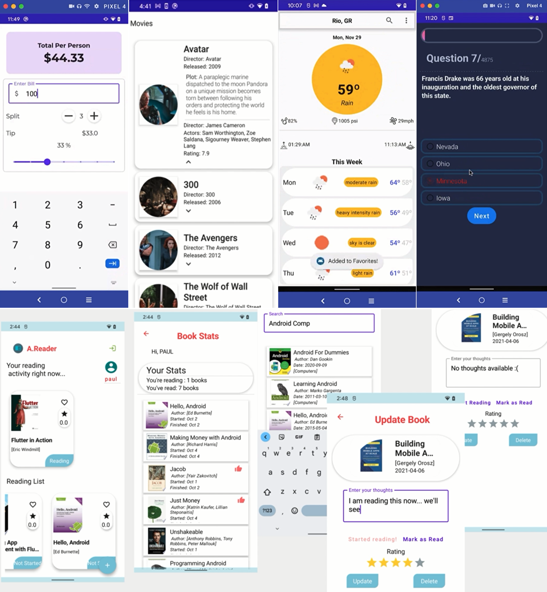
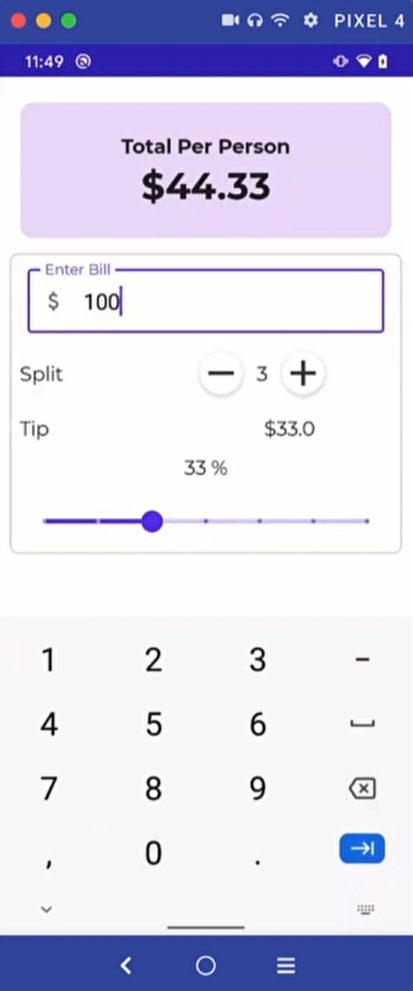
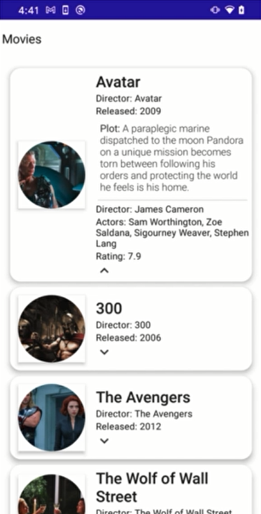
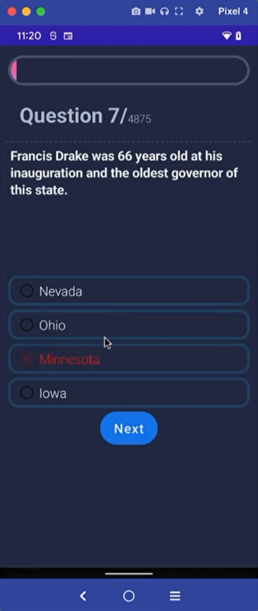
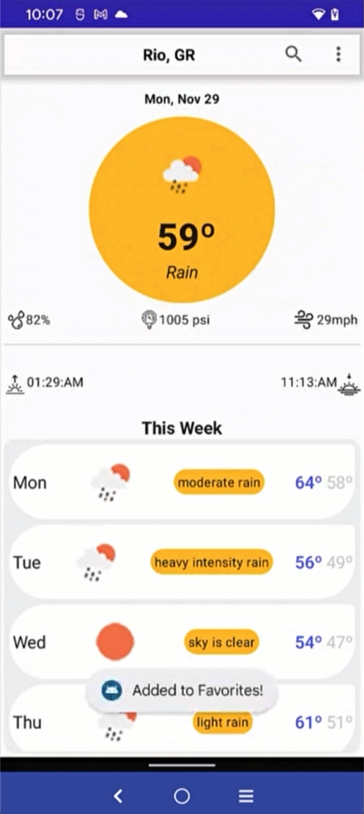
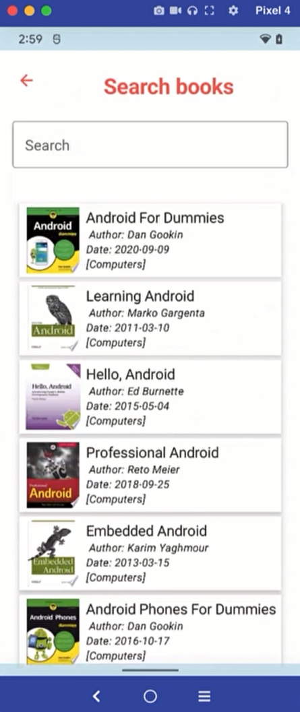

# 5 Android Projects (Educational Purpose)

### Overview

This repository contains 5 different Android projects. All projects are implemented with Kotlin programming language and Jetpack Compose toolkit. Of course, the purpose of this repository is to learn the Jetpack Compose toolkit, and we have tried not to add unnecessary complications to it.

To try out these apps, you need to use Android Studio. You can clone this repository or download it via [This](https://github.com/gymofjava/android-projects/archive/refs/heads/main.zip) link.

🧬 Projects
------------
| Description                                                                                                                                                                                                                                                                                                                                                                                                                                                     | Image                                                                                                 |
|:----------------------------------------------------------------------------------------------------------------------------------------------------------------------------------------------------------------------------------------------------------------------------------------------------------------------------------------------------------------------------------------------------------------------------------------------------------------|-------------------------------------------------------------------------------------------------------|
|   A sample tip calculator project that demonstrates the use of Jetpack Compose with real-world architecture.    • Low complexity • Light theme • Resource loading • UI Testing    **[> Browse](TipCalculatorApp/)**                                                                                                                                                                                                               |  |
|                                                                                                                                                                                                                                                                                                                                                                                                                                                                 |                                                                                                       |
|  A simple movie search app that focuses on UI state patterns and text input.  • Low complexity • Material Design theme and Material You dynamic color • Resource loading • Animation • UI Testing  **[> Browse](MovieApp/)**                                                                                                                                                                                                   |                               |
|                                                                                                                                                                                                                                                                                                                                                                                                                                                                 |                                                                                                       |
|  A sample trivia app that showcases multiple input, validation and UI state management in Jetpack Compose.  • Medium complexity •`TextField`, `RadioButtons`, etc. • form validation  • ProgressBar implementation • Element reusability and styling • Various form elements   **[> Browse](TriviaApp/)**                                                                                                                |                             |
|                                                                                                                                                                                                                                                                                                                                                                                                                                                                 |                                                                                                       |
|  Weather forecast app is a multipage app built with Jetpack Compose.  • Medium complexity • Custom design system • Custom layouts • Animation  **[> Browse](WeatherForecastApp/)**                                                                                                                                                                                                                                                |           |
|                                                                                                                                                                                                                                                                                                                                                                                                                                                                 |                                                                                                       |
|  A sample book store app use Redux-style architecture and showcases dynamic themes.  • Medium complexity • Integration with Architecture Components: Navigation, Fragments, LiveData, ViewModel • Image fetching • Local storage with Room  **[> Browse](ReaderApp/)**                                                                                                                                                            |                             |

### Tools & Technologies
* [Kotlin] - Programming Language
* [Gradle] - Build Tool
* [Git] - Version control
* [Jetpack Compose] - UI Toolkit
